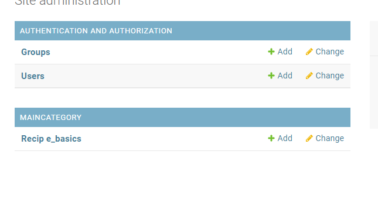
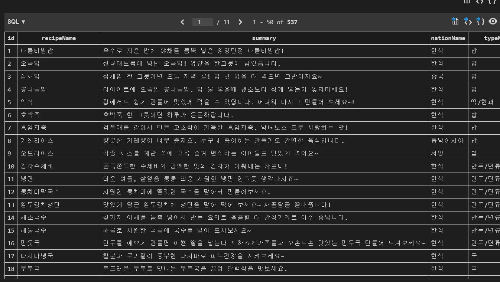
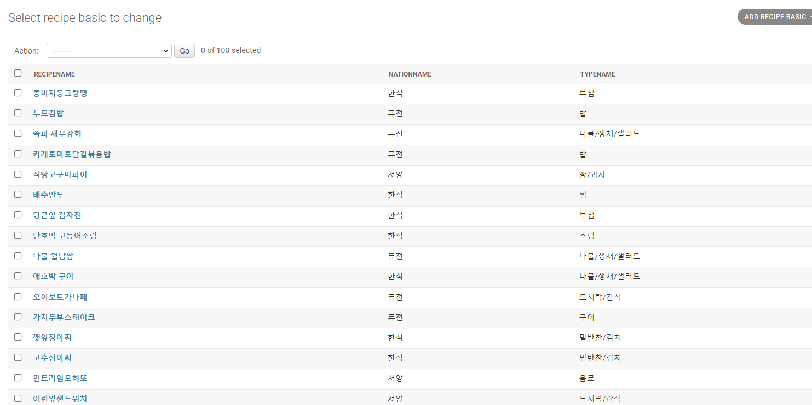

# gonmo_api_Django

## 0426

### Django setting

- secretkey 설정 
- restful_api 설정

- 내일은 api 가져와서 DB적용하기. 

## 0427

- 회의 결과 
  - 백앤드는 express/ django로 일단 둘 다 개발해보기 
- 내 역할 : 메인 페이지 구축 위한 REST API 서버 만들기 

## 0428

### sqlite- > mysql

- https://hongjuzzang.github.io/howto/mysql_django/

### 데이터 구축 

- 크롤링을 해서 데이터를 받은 후 DB에 그 때마다 데이터를 넣는다고 생각했는데 너무 비효율적이다 .
- 그냥 엑셀 받아서 전처리하고, 모델 깔끔히 만들어서 RESTAPI 넘겨주기로 함 
- image를 어떻게 넘겨줄지 고민해야함 
  - image가 파일 형태로 되어있는데 이걸 다 DB에 넣어야하나? 
  - http://file.okdab.com/recipe/148291443772500013.jpg

### 문제 발생 

#### 모델명을 RECIPE_BASIC으로 설정했는데,아래 형태로 형식이 맞지 않음, 언더바 제거를 고려 (해결)

- 

#### 레시피 기본정보.csv  calorie 필드에 0kcal/null인 데이터가 있음, idrType(재료 종류)에도 null 존재 

-  (null을 0칼로리로 조정? 홈페이지에서 세부 정보 찾아서 일일이 수정해야할 것 같음  )
-  칼로리 2개, idrType 55개 null 존재 
- 일단 model에 null=True옵션을 줘야 불러올 수 있을 것 같다. 

#### CSV 데이터 Sqlite3 DB에 옮기기 완료 

```python
import csv
import os
import django
os.environ.setdefault("DJANGO_SETTINGS_MODULE", "mafrapjt.settings")
django.setup() 
from Maincategory.models import recipeBasic
csv_path = 'C:/Users/SAMSUNG/Desktop/web_pjt/Maincategory/data/recipe_basic.csv'
with open(csv_path, newline='',encoding='utf-8') as f_csv:
		row_dics = csv.DictReader(f_csv)
		for row in row_dics: 
			print(row)
			recipeBasic.objects.create(
				recipeName = row['recipeName'],
                summary = row['summary'],
                nationName = row['nationName'],
                typeName = row['typeName'],
                cookingTime = row['cookingTime'],
                calorie = row['calorie'],
                QNT = row['QNT'],
                level = row['level'],
                idrType = row['idrType'],
                image = row['image'],

			)
```

- DB에 옮기는데 2시간정도 걸렸다... 다양한 문제가 있었다.
  1. 경로 설정 문제
     - python file을 앱내부에 놔뒀더니 import error가 계속 생겼다.
     - 경로의 문제인줄 알고 상대경로/절대경로 변경, BASE_DIR 설정 등 다양한 솔루션을 적용했으나 실패했다.
     - 그래서 Python 파일을 여러 곳에 옮겨 봤는데, root폴더와 같은 위치에 넣으니 import 부분은 해결되었다.
  2. field명 매칭 문제 
     - field 이름이 엑셀의 데이터 이름과 매칭되지 않아서 에러가 발생했었다.
     - 필드명을 매칭시키고 엑셀 데이터를 수정 한 후 encoding을 utf-8로 맞춰주니 문제를 해결할 수 있었다.

- 산출물 




## 0429

### API

- 1차적으로 레시피 기본정보만 담긴 API 구축 성공 

### 추가 필드 생성

- 레시피 기본 -> 레시피 과정 (1:N)
- 레시피 기본 -> 레시피 재료 (1:N)

#### 문제 발생

- 레시피 재료에는 있지만 레시피 기본에 없는 필드 발견  
- pk를 맞춰주기 위해, rawdata PK를 변경 
  - 삭제 데이터 501~515, 517~530, 532~540 

##### 해결 완료

### 카테고리 API 구축하기

- 카테고리나 요리의 국가분류(?)를 하려면 각 요리의 타입이나 국가의 key가 있어야하는데 해당 필드를 추가하지 않았었다.
- 따라서, 카테고리와 국가분류 DB 만들고 레시피와 1:N 관계를 만들도록 DB를 다시 구축해야겟다.  
- 재료테이블도 만들어야겠따..
